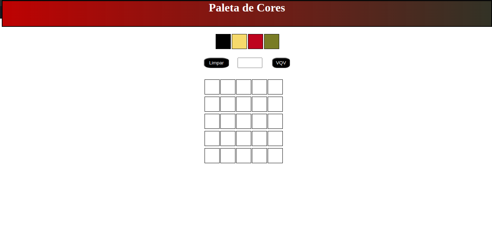

<h1 align="center">Project Pixels Art</h1>

<h2>Projeto Desenvolvido com HTML, CSS3 e Javascript no módulo de fundamentos da <a href="https://www.betrybe.com/">Trybe.</a></h2>

<h3>Informações sobre o projeto</h3>

<h3>Para criação do projeto foi proposto que fosse construido um grupo de quadrados que fosse possivel colorir.</h3>

<li>Foi usado o HTML para construir o corpo do projeto</li>
<li>Foi usado javascript para construir toda a outra parte interativa do site, como a criação dinamica dos quadrados</li>
<li>Foi usado CSS3 para stylizar</li>

<h4>Principais tecnologias utilizadas</h4>

<li>HTML</li>
<li>CSS3</li>
<li>JavaScript</li>
<li>Eslint</li>
<li>Stylelint</li>
